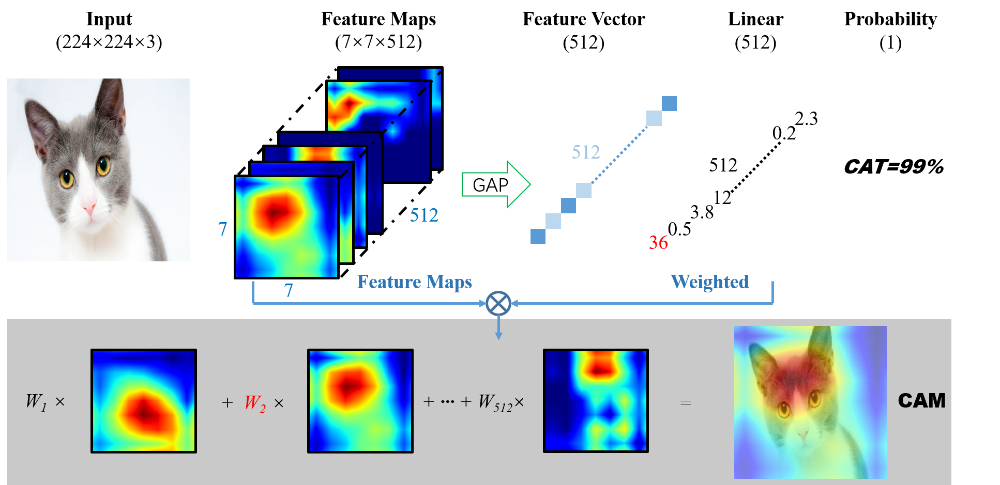
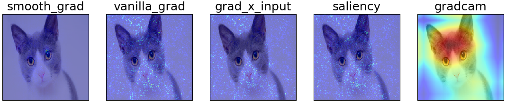

# PyTorch-CAM
This project provide a script of class activation map (CAM) visualizations, which can be used for explaining predictions and model interpretability, etc.

<p align="center"></p>

## Installation

- Install via pip

```
$ pip install torchcam
```

- Install from source

```
$ pip install --upgrade git+https://github.com/Tramac/torchcam.git
```

## Usage

```python
from torchcam import open_image, image2batch, int2tensor, getCAM
from torchvision.models import resnet18

img = open_image('./data/cat.jpg', (224, 224), convert_mode='RGB')
input = image2batch(img)
image_class = 284 # cat class in imagenet
target = int2tensor(image_class)

model = resnet18(pretrained=True)
```

- **Basic**

```python
# gradcam
cam = getCAM(model, img, input, target, display=True, save=False)
```

- **Adavanced**

Besides the default `gradcam` method, these following additional methods are alse available: `vanilla_grad, grad_x_input, saliency, integrate_grad, deconv, smooth_grad`.

```python
from torchcam import saliency

results = saliency.get_image_saliency_result(model, img, input, target, methods=['smooth_grad', 'vanilla_grad', 'grad_x_input', 'saliency'])
figure = saliency.get_image_saliency_plot(results, display=True, save=False)
```

- **Yours own model**

```
model = YourModel()

cam = getCAM(model, img, input, target, layer_path=['xxx']) # The end backprop layer key in your model
```

## Result

<p align="center"></p>

## TODO

- [ ] support more explainer
- [ ] optim code
- [ ] test your own model

## Reference

- [tensorwatch](https://github.com/microsoft/tensorwatch)
